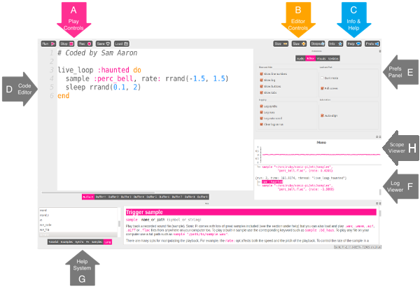
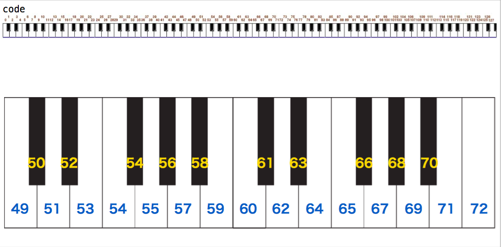
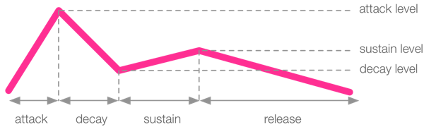

<style type="text/css">
  .reveal h1,
  .reveal h2,
  .reveal h3,
  .reveal h4,
  .reveal h5,
  .reveal h6 {
    text-transform: none;
  }
  .reveal ol,
  .reveal dl,
  .reveal ul {
    font-size: 0.75em;
    display: block;
    text-align: left;
  }
  .reveal section img {
    background: none;
    border: none;
    box-shadow: none;
  }
  .reveal code {
    font-family: monospace;
  }
</style>
### Creating Coding School Sapporo 2017

##### 札幌国際芸術祭編

<span style="color:#EEEEEE">Sonic Piでライブコーディング</span>

##### 金井 謙一

<span style="color:#EEEEEE">ARTSAT x SIAF LAB.</span>

---

#### Sonic Pi

---
#### Sonic Pi


- http://sonic-pi.net/
- "The Live Coding Music Synth for Everyone"
- Sam Aaronが開発
- Rubyベース

---

- コードで音楽を表現する
- ライブコーディング
- プログラミング教育

---

#### コードで音楽を表現する

- スティーヴ・ライヒ - ピアノ・フェイズ（Piano Phase）
  - Sam Aaronのコードから
  - https://gist.github.com/samaaron/997ba2902af1cf81a26f
  - [wikipedia](https://ja.wikipedia.org/wiki/%E3%83%94%E3%82%A2%E3%83%8E%E3%83%BB%E3%83%95%E3%82%A7%E3%82%A4%E3%82%BA)参照

```ruby
notes = (ring :E4, :Fs4, :B4, :Cs5, :D5, :Fs4, :E4, :Cs5, :B4, :Fs4, :D5, :Cs5)

use_synth :piano
live_loop :slow do
  play notes.tick, pan: -1
  sleep 0.151
end

live_loop :faster do
  play notes.tick, pan: 1
  sleep 0.15
end
```

---

#### コードで音楽を表現する

- Sonic PiコミッターのXavier Riley氏(heroku)の作ったコード
  - https://gist.github.com/xavriley/87ef7548039d1ee301bb
  - Sonic Piで最も有名なコード(個人的見解)
  - 2016年のRubyKaigiでも、Julian Cheal氏が紹介
  - http://rubykaigi.org/2016/presentations/juliancheal.html

---

#### ライブコーディング

- 「コンピュータの言語であるプログラムコードを直接操作することで、さまざまな音や映像をリアルタイムに生成する即興演奏の方法」

- TopLap https://toplap.org/
  - ライブコーディング・マニフェスト
  - https://toplap.org/wiki/ManifestoDraft

- Algorave https://algorave.com/
  - ライブコーダーによるレイヴイベント

---
- Sonic Piも`live_loop`他の仕組みでライブコーディングが可能に

- Sam Aaronが自身のライブコーディングを配信している
  - https://www.youtube.com/user/samaaronuk/videos
  - 個人的に好みなのは、https://www.youtube.com/watch?v=G1m0aX9Lpts

---
#### プログラミング教育

- ラズベリーパイ(raspbian-jessie)に標準搭載
- Scratch, Processingに続く存在という認識(個人的見解)
- 教育用のリソースも公式ページにあったりする

- SIAFラボの子ども向けワークショップ(2015年)
  - http://siaf.jp/siaflab/2015/09/11/kodomo_ws/

---
#### Sonic Piを学ぶ

- 公式(付属)のチュートリアル

- 田所さんの講義資料
  - http://yoppa.org/teu_media17
  - http://yoppa.org/tau_sound16

- 公式(付属)の例

---

### 実際に使ってみよう

---

#### 画面の簡単な説明



---

#### ライブループ

---

- 以下のコードをBufferにコピー＆ペーストして、`Run`ボタンを押してみてください。

```ruby
live_loop :flibble do
  sample :bd_haus, rate: 1
  sleep 0.5
end
```

---

- 続いて、Bufferの内容を以下のように変更して、`Run`ボタンを押してみてください。

```ruby
live_loop :flibble do
 sample :ambi_choir, rate: 0.3  # この行を追加
 sample :bd_haus, rate: 1
 sleep 0.5
end
```

---

- ビートを止めずに演奏内容を変更できたと思います。

- 音を止めるには、`Stop`ボタンを押してください。

---

- コードの解説

```ruby
live_loop :flibble do     # live_loopブロックの宣言。:flibbleという名前を付与。
 sample :bd_haus, rate: 1 # :bd_hausというサンプルを再生。
 sleep 0.5                # スリープ。次の繰り返し開始までの拍数を指定。
end
```
---

- ライブループの仕組み自体について知りたい方は、以下を参照ください。
  - https://kn1kn1.github.io/2016/02/06/In-N-Out-Sonic-Pi-Pt.II.html

---

#### シンセ

---

- 単純な音を出してみましょう。

```ruby
live_loop :a do
 play 60
 sleep 1
end
```

- これは、サイン波で第4オクターブのCを鳴らしています。
- 以下のコードと同じです。

```ruby
live_loop :a do
 use_synth :beep
 play :c4
 sleep 1
end
```

---

- playの後の60は、MIDIノート番号と呼ばれているものです。
  - 鍵盤との対応は以下を参照
  - (出典: http://yoppa.org/teu_media17/8322.html)



---
#### オプション（音量）

- `play`の後ろに、`amp: 0.5`を付けると音量を変えることができます。

```ruby
live_loop :a do
  play 72, amp: 0.5
  sleep 1
end
```

- この`key: value`の組み合わせをオプションと呼んでいます。

---
#### オプション（パン）

- `pan: -1`で音の位置を変えることができます。

```ruby
live_loop :a do
  play 72, amp: 0.5, pan: -1
  sleep 1
end
```

- 左から音が出たと思います。panで指定可能な値は、-1(左)〜0(中央)〜1(右)です。

---

#### 和音

- 複数の`play`を書くと、全て同時に演奏されます。

```ruby
live_loop :a do
  play 72
  play 75
  play 79
  sleep 1
end
```

- `chord`で和音名で指定することも可能です。

```ruby
live_loop :a do
  play chord(:E5, :minor)
  sleep 1
end
```

- 左下のヘルプの`命令`に`chord`がありますので、そちらを参照してください。

---
#### メロディー

- `play`の間に`sleep`を入れると、1音ずつ演奏されます。

```ruby
live_loop :a do
  play 72
  sleep 1
  play 75
  sleep 1
  play 79
  sleep 1
end
```

- 同じことを`play_pattern`で書くことができます。

```ruby
live_loop :a do
  play_pattern [72, 75, 79], sustain: 0
end
```

---
- `play_pattern`に`chord`を渡すことも可能です。

```ruby
live_loop :a do
  play_pattern chord(:E5, :m7)
end
```

---
#### スケール

- `scale`で様々なスケール(音階)を取得できます。
- 以下は、C5メジャースケールです。

```ruby
live_loop :a do
  play_pattern scale(:c5, :major)
end
```

- これを同じC5から始まる`:hirajoshi`(平調子)に変更してみます。

```ruby
live_loop :a do
  play_pattern scale(:c5, :hirajoshi)
end
```

- 左下のヘルプの`命令`に`scale`がありますので、そちらを参照してください。

---
#### シンセを切り替える

- ノコギリ波を使ってみます。

```ruby
live_loop :a do
  use_synth :saw
  play 38
  sleep 0.25
  play 50
  sleep 0.25
  play 62
  sleep 0.25
end
```

---
- `:prophet`に変更してみます。

```ruby
live_loop :a do
  use_synth :prophet
  play 38
  sleep 0.25
  play 50
  sleep 0.25
  play 62
  sleep 0.25
end
```

---
- 一音ごとに変更してみます。

```ruby
live_loop :a do
  use_synth :tb303
  play 38
  sleep 0.25
  use_synth :dsaw
  play 50
  sleep 0.25
  use_synth :prophet
  play 57
  sleep 0.25
end
```

---
#### シンセを見つける

- 左下のヘルプに`シンセ`をクリックすると一覧が表示されますので、そちらを参照してください。

- 以下のようなものがあります。

```ruby
:prophet
:dsaw
:fm
:tb303
:pulse
```

---
#### 音の長さを変える

- 音の長さを変える簡単な方法は、releaseオプションを追加することです。

```ruby
play 72
```

- 上のコードの`play`の後ろに、`release: 4`を付けてみます。

```ruby
play 72, release: 4
```

---
<!-- .slide: data-background="#EEEEEE" data-transition="page" -->

#### ADSRエンベロープ

- releaseはADSRエンベロープの一つです。


---
- ADSR
  - *attack*（アタック）- 音量を0から`attack_level`まで移行させる時間
  - *decay*（ディケイ）- 音量を`attack_level`から`decay_level`まで移行させる時間
  - *sustain*（サステイン）- 音量を`decay_level`から`sustain_level`まで移行させる時間
  - *release*（リリース）- 音量を`sustain_level`から0に移行させる時間


---
- Sonic Piでは、ADSRそれぞれの時間と、attack_level, decay_level, sustain_levelの音量をそれぞれ指定できます。

```ruby
play 60, attack: 0.5, attack_level: 1, decay: 1, sustain_level: 0.4, sustain: 2, release: 0.5
```

---

- attackを長くすることでアンビエント風になったりします。
- 例にあるDarin WilsonのAmbient Experiment

```ruby
use_synth :hollow
with_fx :reverb, mix: 0.7 do

  live_loop :note1 do
    play choose([:D4,:E4]), attack: 6, release: 6
    sleep 8
  end

  live_loop :note2 do
    play choose([:Fs4,:G4]), attack: 4, release: 5
    sleep 10
  end

  live_loop :note3 do
    play choose([:A4, :Cs5]), attack: 5, release: 5
    sleep 11
  end

end
```

---
#### サンプル

---

- サンプル音源を再生するには、sampleを使用します。

```ruby
sample :loop_amen
```

- シンセと同じように、amp, panを指定可能です。

```ruby
sample :loop_amen, amp: 0.5, pan, -1
```

---

- rateを指定することで、速く再生したり、遅く再生したりできます。

```ruby
sample :loop_amen, rate: 2
```

```ruby
sample :loop_amen, rate: 0.5
```

- マイナスの値を指定することで、逆再生も可能です。

```ruby
sample :loop_amen, rate: -1
```

---

#### サンプルを見つける

- 左下のヘルプの`サンプル`をクリックし、カテゴリを選ぶと、使用できるサウンドのリストが表示されます。

- また、`sample `まで入力すると、オートコンプリートによりサンプルの候補が出てくるのでこれを辿る方法もあります。

---

#### サンプルのオプション色々

- start, endで部分再生

```ruby
sample :loop_amen, start: 0.4, finish: 0.6
```

- 逆再生で部分再生

```ruby
sample :loop_amen, start: 0.6, finish: 0.4
```

---
- beat_stretchで指定した拍数に合わせる

```ruby
live_loop :a do
  sample :loop_amen, beat_stretch:2
  sleep 2
end
```

- 逆再生も可能です。

```ruby
live_loop :a do
  sample :loop_amen, beat_stretch:2, rate: -1
  sleep 2
end
```

---

#### ランダム

---

- 作品をより面白いものにするのに、演奏にランダム的な要素を追加してみましょう。

---
- `rrand`は引数で指定した最小値〜最大値の間の数値を返します。

```ruby
live_loop :a do
  play rrand(50, 95)
  sleep 1
end
```

- `rrand`は少数を含む数値が返ります。
- `rrand_i`を使うと、整数のみを返すようになります。

```ruby
live_loop :a do
  play rrand_i(50, 95)
  sleep 1
end
```

---

- `choose`を使うと、リストから一つランダムに要素を返します。

```ruby
live_loop :a do
  play [72, 75, 79].choose
  sleep 1
end
```

- `choose`に渡すリストの生成に、`chord`や`scale`も使用可能です。

```ruby
live_loop :a do
  play chord(:E4, :m11).choose
  sleep 1
end
```

---

- `shuffle`を使うと、リストをシャッフルします。
- 次の例は、`shuffle`と`play_pattern_timed`を使って生成した「リフ」です。

```ruby
notes = chord(:E4, :m7).shuffle
times = [0.125, 0.25, 0.5].shuffle
live_loop :a do
  play_pattern_timed notes, times
  sleep 1
end
```

---

- ところで、先程の例は何度実行しても同じリフが生成されたと思います。
- Sonic Piのランダムは擬似乱数から生成されたもので、必ず同じものになります。
- これを変えるには`use_random_seed`を使います。

```ruby
use_random_seed 1 # この行を追加
notes = chord(:E4, :m7).shuffle
times = [0.125, 0.25, 0.5].shuffle
live_loop :a do
  play_pattern_timed notes, times
  sleep 1
end
```

- リフが変わったと思います。
- `use_random_seed`に適当な値を入れていくことで、好きなだけリフを探求することができるようになりました。

---

- `use_random_seed`を使用しない場合は、`use_random_seed`に`0`を指定したのと同じです。

```ruby
use_random_seed 0 # 0の場合、あってもなくても同じ
notes = chord(:E4, :m7).shuffle
times = [0.125, 0.25, 0.5].shuffle
live_loop :a do
  play_pattern_timed notes, times
  sleep 1
end
```

---

<!-- .slide: data-background="#FFFFFF" data-transition="page" -->


